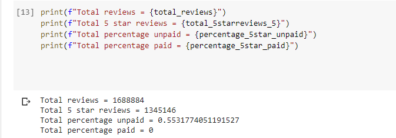

# Amazon_Vine_Analysis

## Overview
The purpose of this analysis is to analyze Amazon reviews written by members of the paid Amazon Vine program. 

## Result

As seen above, here are the results:
- There were no Vine reviews, therefore all 1688884 reviews were non-vine reviews
- All 1345146 5-star reviews were non-vine reviews
- There is no percentage of Vine reviews that are 5 stars since there are no vine reviews. 55.32% of non-vine reviews were 5 stars.

## Summary
As a summary, this dataset was not a good dataset to choose in order to see if there is a positive bias with the Vine program as there were no Vine reviews in the dataset. One additional analysis that we could do with the dataset to suppor tthe statement is to count the total number of Vine reviews without filtering fo rthe number of helpful votes and total votes. 
